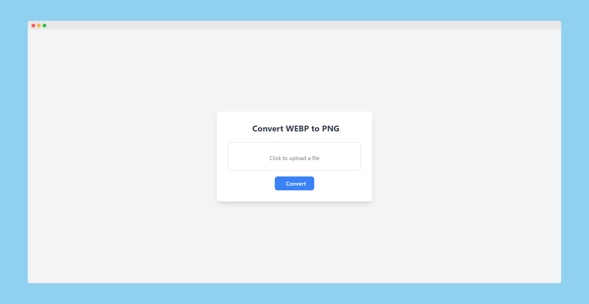

# Flask WEBP to PNG Converter

This is a simple Flask web application that allows users to upload a WEBP file and get a PNG file in return. The application uses Pillow (PIL fork) to handle the image conversion.



## Features

- Upload WEBP files
- Convert WEBP files to PNG format
- Download the converted PNG files

## Requirements

- Python 3.9 or higher
- Flask
- Pillow
- Docker (for containerization)

## Installation

1. Clone the repository:

    ```bash
   git clone https://github.com/tshenolo/flask-webp-to-png.git
   cd flask-webp-to-png
    ```

2. Create and activate a virtual environment:
    ```bash
    python3 -m venv venv
    source venv/bin/activate  # On Windows use `venv\Scripts\activate`
    ```

3. Install the dependencies:
    ```bash
    pip install -r requirements.txt
    ```

## Running the Application

1. Set the FLASK_APP environment variable:  
    On Linux  
    ```bash
    export FLASK_APP=app.py 
    ```
    On Windows
    ```bash
    set FLASK_APP=app.py
    ```

2. Run the Flask development server:
    ```bash
    flask run
    ```

3. Open a web browser and go to http://127.0.0.1:5000/.


## Dockerization
### Building the Docker Image
1. Build the Docker image:
    ```bash
    docker build -t flask-webp-to-png .
    ```

### Running the Docker Container
1. Run a container from the image:
    ```bash
    docker run -d -p 5000:5000 flask-webp-to-png
    ```

2. Open a web browser and go to http://127.0.0.1:5000/.

## Project Structure
    /flask-webp-to-png
    ├── app.py
    ├── templates
    │   └── upload.html
    ├── requirements.txt
    └── Dockerfile

## Contributing
1. Fork the repository.
2. Create a new branch (git checkout -b feature-branch).
3. Commit your changes (git commit -am 'Add new feature').
4. Push to the branch (git push origin feature-branch).
5. Create a new Pull Request.

## License
This project is licensed under the MIT License. See the LICENSE file for details.


